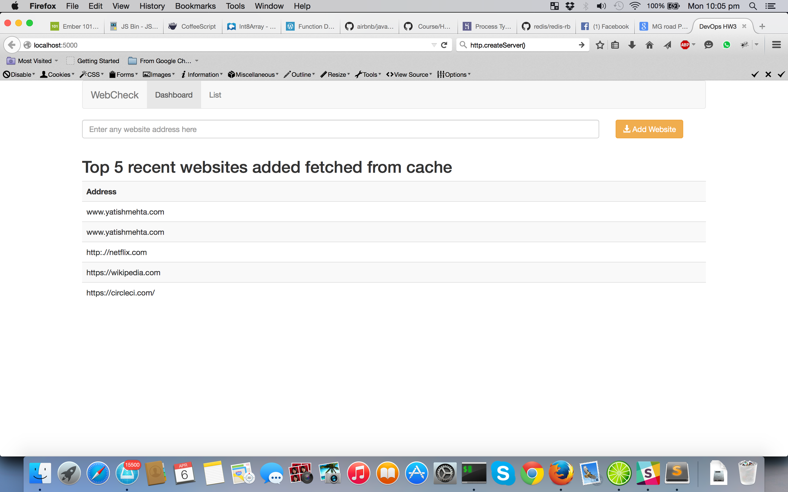
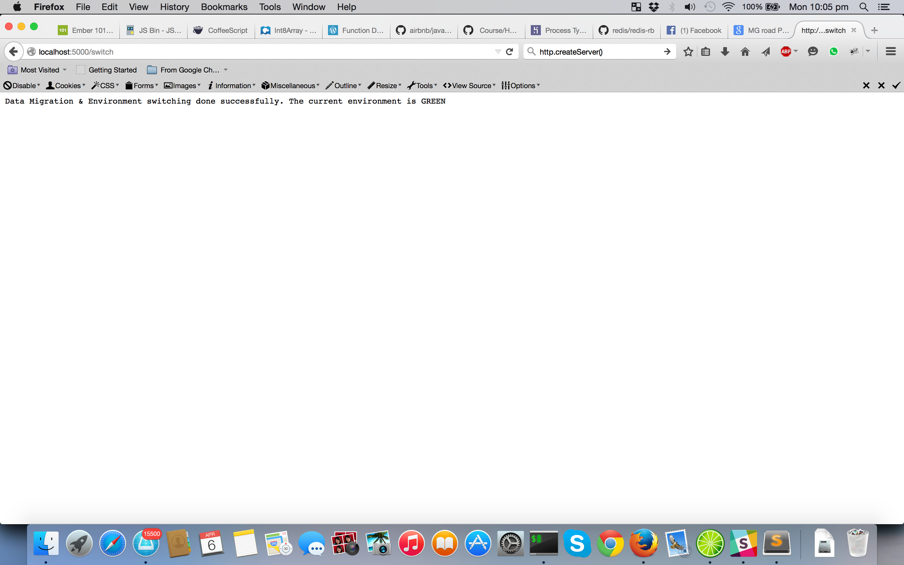

# HW4: Blue Green Deployment and DataMigration
This HW includes the combination of the app built in HW3 `app` which is used as the target application for deployment.
Few modifications were needed in the target app. Now, it can take the redis port and webserver post as arguments while booting up. 
There is `deploy` folder consists of the blue and green parallel infrastructure track.

## Evaluation
### __Git/hook__

Added a git hook `post-receive` in the respective environments, hence as soon as git push is done it deploy the code to its respective environment.
It also installs the gems if needed.
Added the green and blue remotes to app, hence whenever code is pushed, it get deployed to www-*.

```
#! bin/sh
GIT_WORK_TREE=$HOME/Projects/DevOps/HWs/HW4/deploy/blue-www/ git checkout -f
cd $HOME/Projects/DevOps/HWs/HW4/deploy/blue-www/ && bundle install && cd -

```

### __Blue/Green Infrastructure__

Using the same logic used in teh workshop, there is green and blue parallel instances. The sinatra app is running on PORT 5001(Blue) and PORT 5002(Green). 
There also 2 respective redis instances, running on PORT 6379 and PORT 6380.
For this HW, I am using node server, `infrastructure.js` as the proxy. It runs on PORT 5000. It delegates the requests to respective service instances depending on which one is currently being used.

### __'/switch'__

In `infrastruture.js` I implemented a route '/switch' which switches the entire stack from green to blue and vice versa. It also migrates the data which is stored in redis from one instance to the other.





### Migration of data
In the switch route the data from one redis instance gets copied in the other redis instance. Code is present in `infrastruture.js`
Code 
```
function switchTo(newEnv) {
    REDISCLIENTS[config["INVERSE"][newEnv]].lrange("website:newest", 0, -1, function(_, websites) {
        websites.forEach(function(data) {
            REDISCLIENTS[newEnv].lpush("website:newest", data);
        });
    });
    CURRENT = newEnv;
}
```

### Mirroring

The Mirroring Feature flag can be set in the env.json. env.json is the file which stores the config file.
Some excerpt portion is given below. Details can be seen in `infrastructure.js`
```
if (req.url === '/website' && config['MIRROR'] === 1) {
    var inverse = config['INVERSE'][CURRENT]
    req.pipe(request.post( config[inverse]['ENV']+ '/website'));
    console.log("Data written on both instances")
}
```


