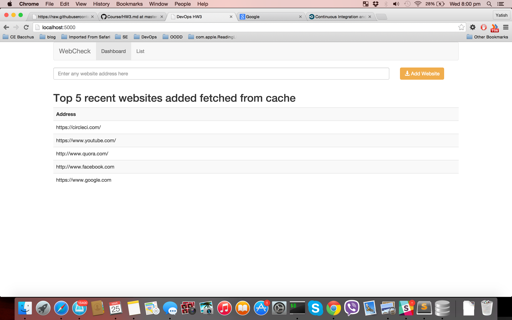
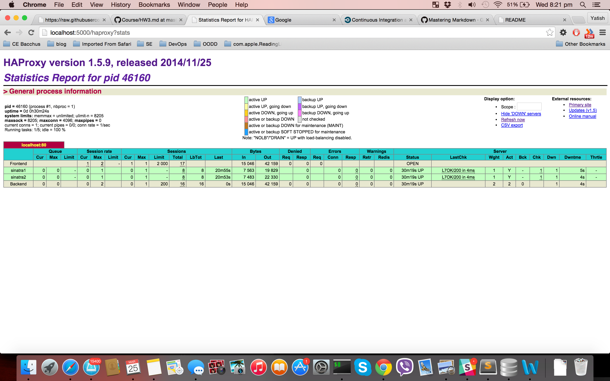

# CSC 591 DevOps HW3

##  Simple three tier web application Option 1
It is a three tier web application built using Redis/sinatra. It also has persistent database layer SQLITE.


## Setup
To run the application
    
    bundle install    

to make sure all the dependecies are installed
Start the application using foreman
    
    foreman start
 
## Evaluation
### Simple three tier web app
We are using Sinatra which is Ruby web framework. We have implemented all three layer. The frontend layer is HTML/CSS(Bootstarp CSS framework).
The Sinatra `app.rb` acts as the service. We are using SQLite as the storage layer.

 

### Caching
The index pages fetches the most recent websites from the redis cache. It does not hit the database for this read requests. It uses `redis` server to store the array of recent websites in the key 'websites:newest'.

### Queue
When writing the websites using the form in the index page it is stored in the queue in the redis server. There is background worker which fetches the data from the queue and then stores the data in SQLite.
When multiple request come in it does not wait for the request to complete the database transaction. The database commit is done by teh background process.
check `worker.rb` for its code. We are using `sidekiq` which is used for background processing.

### Multiple instances
It has multiple instances of the the services running. one running on port 5001 and the other port 5002. We can add more instances by adding them in `Procfile`. To manage all the instances easily we are using `foreman`
We 
```
foreman start
```
to start all the instances.
Check `Procfile` to see all the configuration

### Proxy
The multiple service instances are load balanced using HAproxy. HAproxy roundrobins the request to each instances. The client will hit 'localhost:5000' and the request will be redirected to 5001 and 5002.




